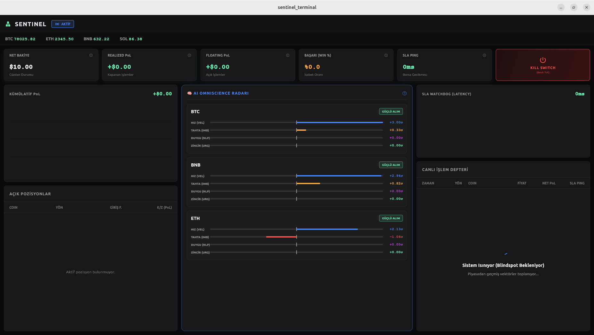
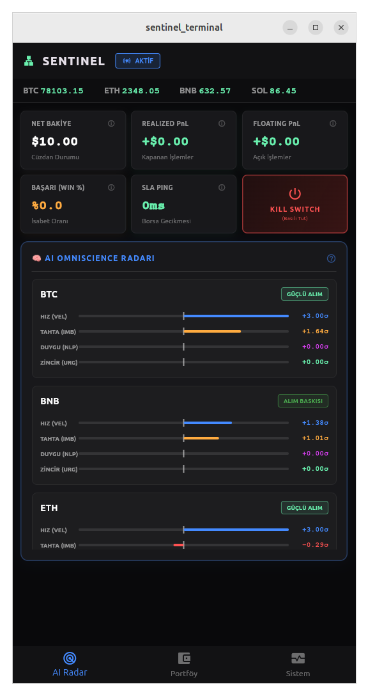

# 🦅 VQ-Capital (Vector Quantitative Capital)

**Institutional Grade Event-Driven Algorithmic Trading Infrastructure**

VQ-Capital, mikro saniye hassasiyetinde veri işleyen, sıfır gecikmeli (zero-latency) mesajlaşma omurgasına sahip ve yapay zeka (LLM/SLM) ile istatistiksel benzerlik (Vector Search) algoritmalarını uçta (Edge) birleştiren yeni nesil bir HFT altyapısıdır.

## 🧠 Felsefemiz (The VQ Way)
1. **Zero Python in Hot Path:** Veri akışı, normalizasyon ve emir iletimi katmanlarında sadece **Rust** ve **C++** kullanılır.
2. **Zero JSON in IPC:** Servisler arası iletişimde JSON yasaktır. Tüm veri paketleri **Protobuf** formatında serileştirilir.
3. **Zero HTTP (Internal):** Mikroservisler birbirleriyle HTTP REST üzerinden konuşmaz. Tüm iletişim **NATS JetStream** üzerinden olay güdümlü (Event-Driven) yapılır.
4. **Vector Memory over Time-Series:** Gelecek tahmin edilmez, mevcut durumun geçmişe benzerliği aranır (**Qdrant**).

## 🏗️ Mimari Topoloji
Sistemimiz, `sentinel-*` önekiyle adlandırılmış, kesin sınırlarla ayrılmış mikroservislerden oluşur. Tüm sistemin tek doğruluk kaynağı (Source of Truth) `sentinel-spec` reposudur.

